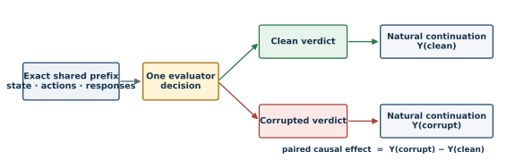

# Same Accuracy, Different Futures

## Causal Structure of Evaluator Errors in Adaptive Agents

**Lingge Meng — Mathematics–Computer Science, University of California San Diego**

**Working technical note — August 2026**

**Status: theory and evidence through G1.1; the preregistered G2b outcome is pending**

## Abstract

Static evaluator accuracy treats mistakes as exchangeable. That abstraction can fail when evaluator verdicts are written into persistent memory, used to revise tools or workflows, or otherwise alter the state from which an agent acts. This note develops a causal account of such errors. An exact-prefix paired intervention holds the complete pre-error history fixed, changes only one delivered evaluator verdict, and allows the two branches to evolve naturally thereafter. A Möbius decomposition then separates singleton error leverage from higher-order interactions and shows why equal error counts do not generally imply equal downstream risk. The empirical program tests the framework in a controlled adaptive system and a persistent-memory coding agent. Existing evidence rejects a generic runaway-instability story: the controlled system is predominantly contractive and additive, while a coding-agent verdict flip reliably changes persistent memory and later code without reducing hidden-oracle accuracy. A preregistered resource-sensitive confirmation likewise finds no downstream harm when later task contracts explicitly override the erroneous lesson. The remaining decisive tests are a frozen matched-error benchmark study, held-out leverage prediction, and equal-budget auditing. No G2 or G2b scientific outcome is currently claimed.

## 1. Motivation

LLM agents increasingly operate inside feedback loops. They write persistent memory, retrieve prior outputs, revise tools, select future data, and adapt policies from evaluator feedback. In these settings, an evaluation is not merely a terminal score. It is an input to the next state of the system.

Let the adaptive state at time *t* be *S_t*, the current task or observation be *X_t*, and the delivered evaluator verdict be *D_t*. A general closed-loop update is

$$S_{t+1}=F_t(S_t,X_t,D_t), \qquad Y_{t+h}=G_h(S_{t+h}),$$

where *Y* is a future loss, regret, capability, or safety outcome. Static accuracy constrains how often *D_t* is wrong on a reference distribution. It does not identify where errors occur, how strongly each verdict changes state, whether an injected difference contracts or persists, or whether multiple errors interact.

This motivates three questions:

- **Attribution:** Which individual evaluator errors cause the largest downstream change?
- **Prediction:** Can local causal leverage predict harm under unseen temporal error processes?
- **Intervention:** Can a fixed trusted-evaluation budget prevent more downstream regret when allocated by causal value rather than error probability alone?

The target claim is deliberately narrower than “feedback loops are unstable.” It is that evaluator errors can have heterogeneous causal consequences, and that this heterogeneity matters for prediction and audit allocation even when static accuracy is matched.

## 2. Causal formulation

### 2.1 Exact-prefix paired interventions

For a candidate verdict at time *t*, construct a clean trajectory and a counterfactual trajectory that share the exact provider-visible and task-visible prefix. The counterfactual replays all model responses, actions, seeds, observations, and environment states through the intervention response. It then changes only the delivered verdict token and resumes live generation after that point.

For a loss-oriented outcome, the signed horizon-*h* causal harm is

$$\lambda_{t,h}=Y_{t+h}[\operatorname{do}(D_t=\text{corrupt})]-Y_{t+h}[\operatorname{do}(D_t=\text{clean})].$$

The magnitude *|lambda_{t,h}|* measures influence regardless of direction; the sign distinguishes harm from benefit. Exact-prefix replay matters because resampling a nominally identical pre-intervention trajectory would mix the effect of the verdict with ordinary model stochasticity.

The design distinguishes three mechanisms. **Marginal influence** is the immediate state change caused by one verdict. **Temporal propagation** asks whether that injected difference decays, persists, or amplifies. **Higher-order composition** asks whether several errors combine additively or interact.

### 2.2 Why matched accuracy is insufficient

Fix a task horizon and let *E* be the set of timesteps at which evaluator verdicts are corrupted. Let *Y(E)* be the resulting terminal loss under the corresponding exact-prefix potential outcome. Define the Möbius coefficient for every nonempty set *A* by

$$m(A)=\sum_{B\subseteq A}(-1)^{|A|-|B|}Y(B).$$

Then the exact identity

$$Y(E)-Y(\varnothing)=\sum_{\varnothing\neq A\subseteq E}m(A)$$

separates singleton effects *m({t})* from pairwise and higher-order interactions. For two error processes *P* and *Q*,

$$\mathbb{E}_P[Y]-\mathbb{E}_Q[Y]=\sum_{A\neq\varnothing}m(A)\{P(A\subseteq E)-Q(A\subseteq E)\}.$$

Equal static accuracy may imply only *E_P|E| = E_Q|E|*. It does not equate the inclusion probabilities above. Therefore matched accuracy alone does not generally identify matched downstream risk.

**Sufficient special case.** If all singleton effects are the same constant and every interaction of order two or higher is zero, then expected loss depends only on the expected number of errors. In that restricted regime, equal accuracy is sufficient. The controlled experiments below are close to this additive, contractive boundary, which is scientifically useful because it prevents the framework from assuming the phenomenon it is intended to test.

### 2.3 Audit value

Let *q_t* be the estimated probability that verdict *t* is wrong and let *a_t* be the expected preventable downstream harm conditional on detecting and correcting that error. With equal audit costs, additive benefits, and no capacity interactions, the expected value of auditing item *t* is *q_t a_t*, so a budget of *B* audits is allocated to the *B* largest products. This rule is not claimed under arbitrary interactions or unequal costs; those cases require a combinatorial or constrained extension. The empirical question is whether an estimated *a_t* improves equal-budget outcomes beyond random, uncertainty-only, or error-probability-only allocation.

## 3. Experimental program

The project is organized as a sequence of gates rather than a search for a favorable benchmark.

1. **Controlled adaptive system.** Test matched-accuracy schedules, isolated impulses, temporal propagation, and interactions in a fully observable setting. Use simple baselines and permutation controls to challenge any apparent dynamics signal.
2. **Coding-agent G1/G1.1.** Establish that one verdict can enter persistent memory and alter future behavior under strict pairing; then test whether that pathway causes hidden-oracle or resource harm under an explicit downstream contract.
3. **Benchmark G2/G2b.** On a frozen 40-question continual-learning benchmark, compare preregistered high- and low-structural-leverage positions with the same confusion type and exactly one evaluator error per counterfactual.
4. **Held-out prediction and auditing.** Fit a leverage estimator only on isolated interventions, freeze it, and evaluate ranking and audit allocation on unseen IID, burst, correlated, and persistent error processes.

Provider failures, malformed outputs, and exhausted retry budgets are operational outcomes, not wrong model answers. They never enter a scientific positive or negative classification.

## 4. Current evidence

| Stage | Main observation | Scientific implication |
|---|---|---|
| Toy V2.6 | Dynamics beyond early true deviation add only ΔR² = 0.00565; residual pooled ρ = 0.3459. | Early perturbation leverage dominates; dynamics add modest signal. |
| Toy V3 | At T = 320, late/early performance ratio = 0.1434; median pairwise interaction = 0; snowball evidence = 0/4. | This regime is predominantly contractive and additive. |
| Coding-agent G1 | One exact-prefix verdict flip changes persistent memory and most later solutions across five seeds, with no hidden-oracle accuracy decline. | Durable causal pathway and behavioral bifurcation, but not harm. |
| Coding-agent G1.1 | Validity checks pass 5/5; positive resource harm occurs in 0/5 seeds; mean normalized operation excess = -0.500. | Explicit authoritative task contracts can stabilize the loop. |
| G2/G2b | Original Groq/Qwen route completes zero trajectories; Gemini synthetic screen passes 24/24; no formal G2b trajectory is complete. | Infrastructure evidence only; no benchmark research outcome. |

### 4.1 A negative contractive regime

The controlled system initially appeared to support strong feedback amplification. Falsification tests showed that a simple early-performance baseline explained much of the apparent held-out predictability. After controlling for early true deviation, state-dynamics features increased log-space R² by only 0.00565, although a within-regime permutation test remained marginally nonzero (approximately *p* = 0.0499).

Long-horizon V3 tests sharpened the interpretation. At *T* = 320, the median late-to-early performance-deviation ratio was 0.1434. The error-density scaling exponent was 0.8718, and *H(20%)/[2H(10%)]* was 1.0012, almost exactly additive. Median normalized pairwise interaction was zero and none of four prespecified checks supported snowballing. The result rejects a generic runaway claim and identifies an important boundary condition: heterogeneous local leverage can exist even when the system subsequently contracts.

### 4.2 Persistent behavioral divergence without oracle harm

The exploratory coding-agent G1 uses a self-authored persistent memory and strict exact-prefix verdict flips. Across five request seeds, the intervention produced stable branch-specific memory and broad future-solution divergence: at least four of five later solutions changed in every seed. Yet hidden-oracle correctness did not decline. The causal path is therefore real—verdict, memory, future code—but behavioral divergence alone is not evidence of utility harm.

G1.1 made the downstream task contract explicit: elements were hashable and implementations had to be expected near-linear. All five paired runs passed the causal validity audit, but positive oracle or resource harm occurred in zero seeds. The flip branch used fewer counted operations on average. This preregistered negative result suggests a concrete stabilization mechanism: authoritative downstream requirements can override a misleading lesson stored in memory.

### 4.3 Operational boundaries

The original G2 model-provider route was frozen before execution and failed to complete question 1 after four documented transport amendments. The hard stop was honored. Six log hashes and failure-pattern counts were published without releasing private trajectories; no clean trajectory, counterfactual, candidate selection, or causal metric exists.

A task-blind synthetic screen then selected Gemini 3.6 Flash after 24 of 24 schema-valid growing-context calls with no retries. G2b froze the model, route, task data, seeds, candidate positions, metrics, retry policy, spend guard, and aggregate decision rule before any real task call. A subsequent launch ended before a complete trajectory because of provider regional availability. This is neither a positive nor a negative result. The next valid execution must restart from scratch in a supported region without changing the frozen research rule.

## 5. Decisive next tests

The next experiments are designed to make the main claim easy to falsify.

- **Matched-error benchmark test.** Complete the frozen G2b high-versus-low structural-leverage comparison for all five request seeds. The result is positive only if all causal audits pass, mean high-minus-low harm is positive, at least four of five seed differences are positive, and mean high-leverage harm is positive.
- **Prospective leverage prediction.** Estimate local influence from isolated interventions, freeze the estimator, and test whether it ranks held-out causal harm beyond early-performance, system-parameter, and uncertainty baselines.
- **Equal-budget auditing.** Compare *q × a* allocation against random, uncertainty-only, and *q*-only policies under the same trusted-oracle budget.
- **Authority transfer.** Repeat the design for another persistent update channel, such as tool revision or training-data selection, to test whether the causal structure transfers beyond memory.

The main claim should be rejected or sharply narrowed if isolated interventions create no reproducible variation, leverage adds no held-out predictive value over strong baselines, or leverage-aware auditing prevents no more regret at equal cost.

## 6. Relation to prior work

Pan et al. [1] show that language-model feedback loops can produce in-context reward hacking missed by static evaluation. This project shares the concern about closed-loop evaluation but asks a different unit-level question: which evaluator verdicts cause which later outcomes under matched error rates?

Performative prediction studies predictors whose deployment changes the distribution they aim to predict [2,3]. Here the feedback channel is an evaluator verdict that modifies an adaptive agent’s internal or external state. Exact-prefix interventions provide a direct causal attribution primitive inside that stateful process.

DAgger demonstrates why sequential learning must account for the state distribution induced by the learned policy [4]. The present design borrows the broader lesson that intervention changes future inputs, while using paired replay to isolate a single feedback decision. Decision-focused learning optimizes predictive systems for downstream decision quality rather than prediction error alone [5]; the proposed audit score similarly combines error probability with preventable decision consequence.

## 7. Limitations and conclusion

The mathematical decomposition is exact but does not by itself provide finite-sample guarantees for estimating high-order effects. Current agent evidence uses one model family, one memory architecture, and short coding tasks; nominal seeds at temperature zero are reproducibility checks rather than independent stochastic samples. No naturalistic benchmark has yet produced a valid causal outcome, and the planned leverage estimator and audit policy have not been tested prospectively. Operational failures are documented precisely because excluding them silently would bias the study.

The contribution at this stage is therefore a falsifiable research program with two grounded findings. First, equal accuracy is not a sufficient causal description unless leverage is homogeneous and interactions vanish. Second, existing experiments reveal both sides of the boundary: evaluator errors can produce durable internal and behavioral divergence, while contractive dynamics and explicit task requirements can prevent that divergence from becoming harm. The decisive question is now whether heterogeneous leverage predicts and prevents downstream regret on a frozen longitudinal benchmark.

## 8. Public artifacts and reproducibility

The public repository separates scientific evidence from operational records. Controlled-system results include code, figures, and validation logs; coding-agent claims link to seed-level audits; G2 reports only hashes and failure-pattern counts from private logs; and G2b publishes its frozen preregistration and task-blind provider-screen summary. Private trajectories, response identifiers, terminal logs, and cost ledgers are excluded from version control. The local verification paths require no API key; live provider calls remain gated by the frozen protocols.

- Repository: https://github.com/Lingge824/closed-loop-evaluation
- Controlled findings: `experiments/toy_system/RESULTS_INDEX.md`
- Coding-agent confirmation: `experiments/coding_agent/audits/g1_1_confirmatory_20260825.md`
- G2 operational audit: `experiments/g2_clbench/G2_OPERATIONAL_INFEASIBILITY_AUDIT.md`
- Frozen G2b protocol: `experiments/g2_clbench/G2B_PREREGISTRATION.md`

## References

[1] A. Pan, E. Jones, M. Jagadeesan, and J. Steinhardt. “Feedback Loops With Language Models Drive In-Context Reward Hacking.” *Proceedings of ICML*, PMLR 235, 2024. https://proceedings.mlr.press/v235/pan24d.html

[2] J. Perdomo, T. Zrnic, C. Mendler-Dünner, and M. Hardt. “Performative Prediction.” *Proceedings of ICML*, PMLR 119, 2020. https://proceedings.mlr.press/v119/perdomo20a.html

[3] G. Brown, S. Hod, and I. Kalemaj. “Performative Prediction in a Stateful World.” *Proceedings of AISTATS*, PMLR 151, 2022. https://proceedings.mlr.press/v151/brown22a.html

[4] S. Ross, G. Gordon, and D. Bagnell. “A Reduction of Imitation Learning and Structured Prediction to No-Regret Online Learning.” *Proceedings of AISTATS*, PMLR 15, 2011. https://proceedings.mlr.press/v15/ross11a.html

[5] B. Wilder, B. Dilkina, and M. Tambe. “Melding the Data-Decisions Pipeline: Decision-Focused Learning for Combinatorial Optimization.” *Proceedings of AAAI*, 33(01), 2019. https://doi.org/10.1609/aaai.v33i01.33011658
